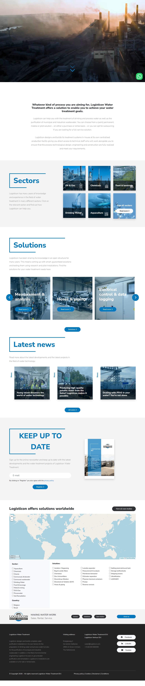
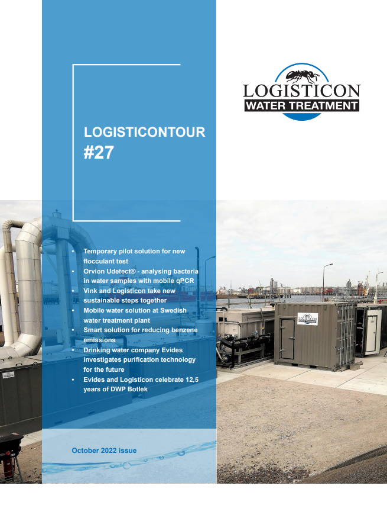

# Visited: https://www.logisticon.com/en/homepage/
**Time:** Fri May  8 11:44:56 UTC 2026

## Screenshot

## Raw HTML
[page.html](./page.html)

## Downloaded Media (1 files)
## Downloaded Media Files

## Other Links
- [/](/)
- [/case-studies/](/case-studies/)
- [/contact/](/contact/)
- [/dist/bootstrap/css/bootstrap.min.css](/dist/bootstrap/css/bootstrap.min.css)
- [/dist/bootstrap/js/bootstrap.bundle.min.js](/dist/bootstrap/js/bootstrap.bundle.min.js)
- [/dist/css/animate.css](/dist/css/animate.css)
- [/dist/css/flipbook.css](/dist/css/flipbook.css)
- [/dist/css/logisticon.css?v=1778240658](/dist/css/logisticon.css?v=1778240658)
- [/dist/css/magnific-popup.css](/dist/css/magnific-popup.css)
- [/dist/css/slick.css](/dist/css/slick.css)
- [/dist/favi/site.webmanifest](/dist/favi/site.webmanifest)
- [/dist/fontawesome/css/all.css](/dist/fontawesome/css/all.css)
- [/dist/js/flipbook/js/flipbook.min.js](/dist/js/flipbook/js/flipbook.min.js)
- [/dist/js/flipbook/js/pdf.js](/dist/js/flipbook/js/pdf.js)
- [/dist/js/flipbook/js/pdfobject.min.js](/dist/js/flipbook/js/pdfobject.min.js)
- [/dist/js/jquery.js](/dist/js/jquery.js)
- [/dist/js/jquery.magnific-popup.min.js](/dist/js/jquery.magnific-popup.min.js)
- [/dist/js/menu.js](/dist/js/menu.js)
- [/dist/js/script.js?v=1778240658](/dist/js/script.js?v=1778240658)
- [/dist/js/slick.js](/dist/js/slick.js)
- [/dist/js/wow.js](/dist/js/wow.js)
- [/dist/webfont/logisticon.css](/dist/webfont/logisticon.css)
- [/en](/en)
- [/en/about](/en/about)
- [/en/about/](/en/about/)
- [/en/case-studies](/en/case-studies)
- [/en/case-studies-logisticon/](/en/case-studies-logisticon/)
- [/en/conditions](/en/conditions)
- [/en/contact-us/](/en/contact-us/)
- [/en/cookies](/en/cookies)
- [/en/news](/en/news)
- [/en/news/](/en/news/)
- [/en/news/dealing-with-pfas-in-your-water-youre-not-alone](/en/news/dealing-with-pfas-in-your-water-youre-not-alone)
- [/en/news/logistcontour-magazine/](/en/news/logistcontour-magazine/)
- [/en/news/producing-drinking-water-from-the-seine-logisticon-makes-it-possible](/en/news/producing-drinking-water-from-the-seine-logisticon-makes-it-possible)
- [/en/news/young-talent-discovers-the-world-of-water-technology](/en/news/young-talent-discovers-the-world-of-water-technology)
- [/en/our-disclaimer](/en/our-disclaimer)
- [/en/privacy-policy](/en/privacy-policy)
- [/en/rental-logisticon](/en/rental-logisticon)
- [/en/sales](/en/sales)
- [/en/sectors](/en/sectors)
- [/en/sectors/](/en/sectors/)
- [/en/sectors/aquaculture](/en/sectors/aquaculture)
- [/en/sectors/aquaculture/](/en/sectors/aquaculture/)
- [/en/sectors/chemicals](/en/sectors/chemicals)
- [/en/sectors/chemicals/](/en/sectors/chemicals/)
- [/en/sectors/communal-wastewater/](/en/sectors/communal-wastewater/)
- [/en/sectors/drinking-water](/en/sectors/drinking-water)
- [/en/sectors/drinking-water/](/en/sectors/drinking-water/)
- [/en/sectors/food-beverage](/en/sectors/food-beverage)

## Stats
- Links: 229
- Media: 1
